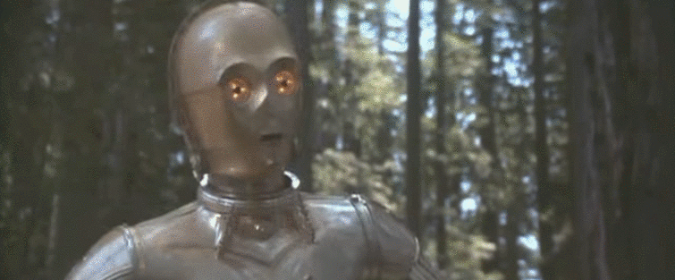

+++
draft = false
title = 'Montage'
slug = 'montage'
weight = 8
summary = ""
editURL = 'https://github.com/sylvainconny/cours-eanis/edit/main/content/${FilePath}'
+++

## Découpage
Le **découpage technique** est un document qui sert de référence et donne  toutes les indications utiles comme la grosseur de plan, l'angle de prise de vue, les mouvements ou les focales.

Il est souvent complété par un **story board**, qui utilise des dessins pour illustrer le découpage plan par plan.

Il existe également le **découpage analytique** qui contient d'autres indications comme le son, l'éclairage ou la composition.



[Exemple à télécharger](./decoupage.pdf)

## Coupe franche ou ponctuations
Les modalités d’enchaînement de deux plans successifs sont variables. Ils peuvent être séparés par une coupe franche ou par un effet optique, qui fait office de ponctuation. Les principaux effets utilisés sont les *volets*, les *rideaux*, les *iris* et les *fondus*.

Le cinéma classique a en partie codifié l’usage de ces ponctuations, mais elles produisent aussi des effets plastiques et sémantiques qui varient en fonction du montage.

Le fondu au noir notamment indique généralement une ellipse. Au blanc, il peut être utilisé pour des flashbacks ou des flashforwards. 







## Raccords
Le mot raccord désigne :
- le point de jonction entre deux plans montés successivement
- l’expression « être raccord », la cohérence visuelle du contenu des plans d’une même scène
- des figures de montage qui renforcent la continuité entre deux plans successifs : raccord de direction, de mouvement, dans le mouvement, dans l’axe, sur le regard.

### Raccord de Direction 
Aussi nommé *raccord d’entrée et de sortie de champ* poursuit le déplacement dans la scène d'un plan à l'autre dans la même direction : si sur le premier plan un personnage sort du cadre à un point donné, sur le plan suivant, le personnage  entre dans le cadre au point opposé.

Exemple : le personnage sort du champ par la droite et au plan suivant il entre par la gauche. Il est aussi possible de le faire aller vers la caméra, obstruant ainsi l'objectif, dans le même axe, au plan suivant.

### Raccord de Position
Un personnage doit avoir la même position dans deux plans successifs.

### Raccord de Mouvement
Consiste à enchaîner deux plans dans lesquels on retrouve une continuité du mouvement.

### Raccord dans l'Axe
Lie deux plans dans le même axe avec des valeurs de cadrage différents.

### Raccord Regard
Lie le regard du personnage à ce qu'il regarde, généralement constitué de trois plans :
  - visage / regard du personnage 
  - objet / décor / personnage(s) observé(s) 
  - retour sur le visage du personnage permettant de voir ses émotions
Il ajoute une dimension expressive car c'est un point de vue subjectif.

### Le Champ / Contrechamp
Articule raccords de regard et règle des 180°, la caméra change à plusieurs reprises d'angle de vue sans changer son cadrage. Il est le plus utilisé pour donner à voir un dialogue. La caméra s'oriente successivement vers le locuteur qui a la parole.

### Raccord panoramique
La caméra effectue un mouvement panoramique sur une scène et au plan suivant la caméra filme une scène différente mais dans le même mouvement.
En principe le mouvement des deux plan va dans le même sens (de gauche à droite ou inversement) et à la même vitesse.

### Raccord par analogie
Il s'agit d'utiliser une analogie de formes ou de couleurs entre deux images pour effectuer le raccord. Ce raccord établit un lien très fort entre les deux objets filmés à rapprocher du procédé rhétorique de la métaphore.

### Faux raccords
Aux raccords s’opposent les faux raccords, qui créent des discontinuités visuelles. On peut en trouver avec l'[émission Faux raccords](https://www.youtube.com/playlist?list=PLAUaCoiUsxl5dhnCco7joRMFs1ydrqbXN) d'[Allociné](https://www.allocine.fr/).



## Exemples
Les transitions dans la série Sherlock









