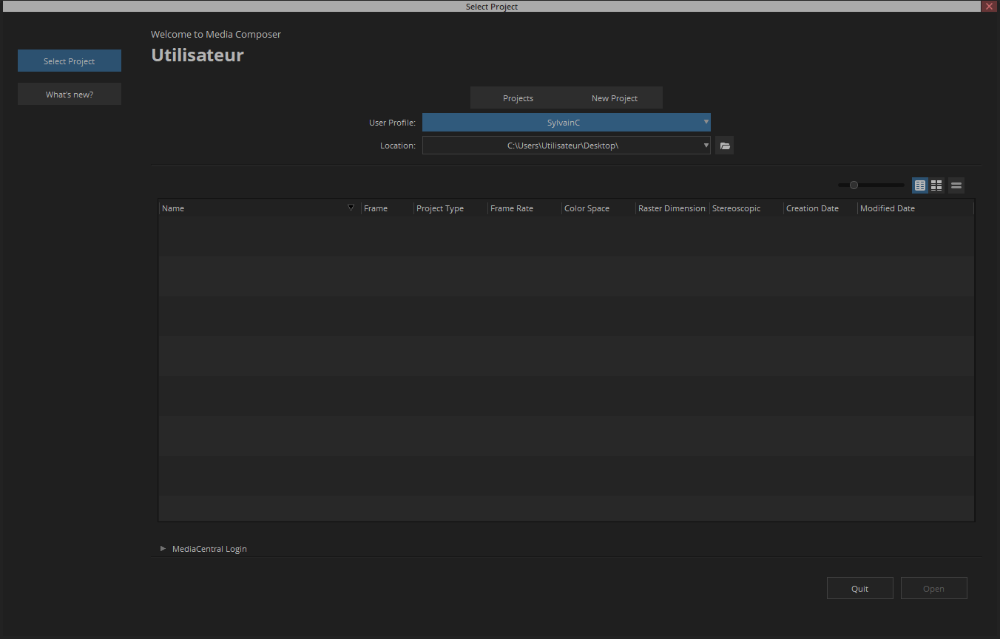
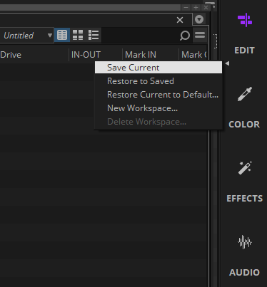

+++
draft = false
title = 'Initiation'
summary = "Démarrage d'un projet, raccourcis…"
weight = 1
slug = 'initiation'
editURL = 'https://github.com/sylvainconny/cours-eanis/edit/main/content/${FilePath}'
+++


Avid Media Composer est le logiciel le plus utilisé pour les projets importants de fiction, documentaire ou publicité. Il a une courbe d'apprentissage plus ardue que les autres, mais il est reconnu pour sa stabilité et son moindre risque de problèmes à long terme.

## Langue

Pour changer la langue du logiciel, il faut se rendre dans le dossier :

C:\Program Files\Avid\Avid Media Composer\SupportingFiles\International\xml

```tree
- C:
   - Programmes (ou Program Files) | folder
      - Avid | folder
         - Avid Media Composer | folder
            - SupportingFiles | folder
               - International | folder
                  - xml | folder
                     - English_override.xml | file
                     - readme.txt | file
```

Comme indiqué dans le fichier *readme.txt*, il faut renommer *English_override.xml* en *override.xml* pour forcer l'anglais.

## Gestion de projets



Pour commencer, il faut dans le Gestionaire de projets, créer un profil utilisateur, dans **User Profile**, **Create User Profile**, sélectionner **Media Composer** et écrire votre nom de profil dans **Profile Name**.

L'onglet **Projects** affiche les projets disponibles dans la **Location** (dossier) indiquée. En cliquant sur l'icône Dossier, on peut retrouver les projets à d'autres endroits, comme notre disque dur par exemple. Dans cette liste, comme sur Adobe ou DaVinci, en mode *liste*, on peut changer les colonnes affichées pour avoir plus ou moins d'informations sur les projets.

En-dessous, l'encart MediaCentral Login permet d'organiser du travail collaboratif avec des serveurs NAS ou SAN comme les [Avid Nexis](https://www.avid.com/products/avid-nexis) utilisés y compris pour du montage à plusieurs sur d'autres logiciels.

Contrairement aux autres logiciels, Avid impose en amont de la création du projet le choix des paramètres comme la définition, le framerate, etc. en fonction des rushes et de la finalité du projet.

Ensuite on sélectionne l'onglet **New Project** :
- on définit le chemin du projet : *Disque:\...\AAAA\AAAAMMJJ_NOM_PROJET\00_PROJETS\*
- on choisit un nom de projet en respectant le workflow (AAAAMMJJ_nom_projet) ; attention, les caractères spéciaux ne sont pas acceptés
On peut cocher la case **Choose for me** afin que les paramètres par défaut restent en suspend jusqu'au premier import de rush dont les paramètres seront définitivement ceux du projet. Mais il est préférable de personnaliser :
- l'improprement nommé **format** désigne le choix de définition / framerate parmi les choix prédéfinis ou choisir *custom* pour personnaliser ces paramètres ; l'aspect ratio s'adapte automatiquement
- **film** ne nous servira pas, car il s'agit de traitement pour pellicule
- on choisit son espace colorimétrique d'export (ou de sortie) dans **Color space**, on choisira souvent *YCbCr 709* (aka Rec 709), le plus courant
- **Stereoscopic** concerne les diffusions en 3D, ne nous concerne donc pas en général
- **Search data folder** … ?
- **Transcription** … ?

**Manage Presets** permet d'enregistrer les paramètres de projets ci-dessus.


Après avoir cliqué sur **Create**, si le projet se trouve sur un stockage externe, le logiciel va nous demander si l'on souhaite monter le volume, il faut sélectionner **Mount all volumes**.


## Disposition
Le logiciel se compose en trois panneaux principaux (séparées sur deux écrans ou non), la *gestion des bins*, les *visionneuse Source et Timeline*, et la *Timeline*.






Pour la gestion des fenêtres, ça ressemble à Adobe Premier Pro, les panneaux se trouvent dans Tools, apparaissent en mode fenêtré, peuvent être intégrés en les glissants dans les rectangles verts, ou être intégrés en tant qu'onglets en glissant avec la touche Alt maintenue.



Sur la droite, plusieurs icônes regroupent des workspaces prédéfinis un peu comme Blender, c'est juste un ajustement de panneaux et de fenêtres, qui peuvent être modifiés et sauvegardés en cliquant sur la flèche à côté de chaque icône et en choisissant *Save current*. On peut revenir à la version par défaut en cliquant sur *Restore Current to default*. On peut également créer de nouveaux workspaces ou cacher ces icônes en bas de la colonne.



## Intégration des rushes
Sur Avid Media Composer, il existe plus façons d'intégrer les rushes :
- le **link**, qui correspond à ce qu'on fait sur les autres logiciels, on lie directement le projet aux rushes importés
- l'**ingest** où le logiciel va transcoder les médias importés et n'utiliser que ces versions des fichiers qu'il a créé.

Dans la fenêtre projet, on a un **bin** par défaut (car dans Avid on ne peut pas importer sans bin). On peut l'ouvrir en double cliquant sur l'icône tiroir. Ceci ouvre un onglet dans le panneau *Bins*, on peut le fermer en cliquant sur la croix en haut à droite.

On peut créer des bins avec un *clic droit* > New bin ou Ctrl \+ N
On peut aussi supprimer des bins en cliquant sur Backspace, ils se retrouvent dans une corbeille, on peut le réintégrer dans nos bins ou vider la corbeille (*clic droit* > empty trash).
Il existe des dossiers, mais pour y insérer des bins, on peut pas créer de bins dans des bins, contrairement aux autres logiciels.



Au moment d'importer dans le **Source browser**, on peut choisir le bin cible (Target) parmi la liste des bins ouverts, en créer un nouveau, ou créer des bins reprenant l'arborescence présente sur notre stockage.

### Link
La version la plus simple de l'import est donc très semblable à celle des autres logiciels :


On peut également linker en glissant / déplaçant les fichiers dans les bins ouverts à condition de maintenant la touche Alt, sinon ces fichiers seront importés en ingest.

## Source
Pour le montage source on retrouve les raccourcis clavier habituels, j, k et l pour se déplacer. i et o pour *In* et *Out*, mais a aussi g pour effacer le *in* et *out*, d pour supprimer seulement le *in* et f pour supprimer seulement le *out*.

Pour intégrer la portion sélectionnée de la source dans la timeline, on peut utiliser la flèche jaune V pour insérer sans écraser, la flèche rouge B pour insérer en écrasant.


## Timeline
Pour créer une séquence, on peut glisser déplacer les rushes dans le panneau timeline vide, mais le plus à propos est de clic droit > *New sequence* > *Default Template* dans le bin adapté (*00_EDIT**).

### Outils de base


Dans les outils de bases, le rouge désigne toujours l'écrasement, le jaune le déplacement. S'applique également avec la touche Suppr. ou Backspace Tous les outils sont également désactivables.

Pour magnétiser la sélection / déplacement, il faut maintenir la touche Ctrl.

À noter que les *vides* peuvent être manipulés comme les éléments.



Pour que les pistes audio / vidéo restent liées et soient déplacées ou trimées en même temps, il faut que l'option **Link Selection Toggle** (Shift \+ L) soit activé.

Pour couper un plan, il existe le bouton **Add edit** avec une icône de pellicule coupée. La coupe s'effectue au niveau de la tête de lecture sur les pistes sélectionnées. Attention, si une piste sélectionnée contient du vide sous la tête de lecture, il sera coupé. Il n'y a pas de raccourcis clavier par défaut, mais cette fonction est généralement bindée avec la touche h



### Gestion des pistes
**Ajout :**
- Ctrl \+ Y pour ajouter des pistes vidéo
- Ctrl \+ U pour ajouter des pistes audio mono
- Ctrl \+ Shift \+ U pour ajouter des pistes audio stéréo

**Sélection :**
- Ctrl \+ A pour sélectionner toutes les pistes
- Ctrl \+ Shift \+ A pour désélectionner toutes les pistes
- le maintien de Shift avec la souris permet de sélectionner plusieurs pistes à la fois

**Général :**
- en appuyant sur la touche Backspace, une fenêtre apparaît demandant si on souhaite supprimer les pistes, on appuie sur Entrée pour confirmer
- le maintien de Ctrl avec la souris permet de déplacer une piste ou de changer la taille
- Ctrl \+ L et Ctrl \+ K permettent de changer la taille de toutes les pistes sélectionnées

Dans le menu *cic droit* > *New* > *Insert track*, on nous propose de créer une piste de tout type, si la piste existe déjà, on nous propose de décaler toutes les pistes.

Comment dans les autres logiciels, il est important de comprendre le ciblage (vert) et la sélection des pistes (bleu). Seules les pistes sélectionnées sont impactées par les actions de montage. La piste ciblée recevra la portion de source choisie.



## Montage
- extract (x)
- lift (w [sur clavier azerty ?])
- portion de plan entre in et out (t) sur la ou les pistes sélectionnées [attention aux sélections de pistes, peut donner un résultat non souhaité]

## Transitions
On peut utiliser les quick transitions audio/video ainsi :


## Export

## Récupérer Avid Media Composer
Se créer un compte, télécharger avid media composer et avant de l'ouvrir, après avoir affiché les fichiers cachés, dans C:\ProgrammesData\Avid\Licences\Pro_Editor (~/Library/Application Support/Avid/Licences sur macOS [à vérifier]) se trouvent une liste de dossiers et de fichiers, il faut les supprimer. Et on a 30 jours d'Avid en période d'essai. À refaire tous les mois.