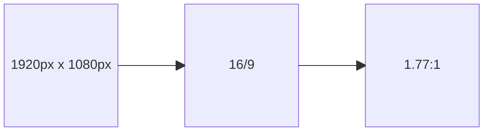

+++
draft = false
title = 'Aspect Ratio'
summary = "L'aspect ratio  c'est le rapport entre la largeur et la hauteur de l'image"
weight = 2
slug = 'aspect-ratio'
editURL = 'https://github.com/sylvainconny/cours-eanis/edit/main/content/${FilePath}'
+++

L'aspect ratio  c'est le rapport entre la largeur et la hauteur de l'image.

* 16/9 (ou 16:9), le plus connu qui correspond aux normes de définition TV
* 4/3
* 1:1

À noter que 16/9 = 1,77 donc on peut aussi l'écrire sous cette forme :

```math
$$\frac{1920}{1080} = \frac{16}{9} = \frac{1.77}{1} = 1.77$$
```

Cette norme d'écriture facilite la visualisation, un rectangle 1,77 fois plus grand que large :



Egalement, le 4/3 c'est du 1,33:1

Exemple, si on a des rushes en Full HD qu'on souhaite exporter dans un ratio 2:1, on se retrouvera avec une définition de 1920x960 car on préserve la largeur (ici 2) et pour la hauteur on divise la largeur par 2, donc 960.

Si on souhaite maintenant un ratio cinémascope 2,4:1 on divise la largeur par 2,4 et ça donne du 1920x800.

À l'inverse, si à partir d'une définition on souhaite retrouver le ratio d'une définition, par exemple 1920x768, le ratio étant le rapport largeur / hauteur on effectue l'opération suivante :

```math {align="left"}
$$1920 / 768 = 2.5$$
```
Le ratio est donc de 2.5:1 ou simplement 2.5

Il existe des sites pour calculer facilement ces opérations comme [unravel](https://www.unravel.com.au/aspect-ratio-cheat-sheet).


**Quelques exemples de définitions vs ratios :**
* 720x480 (SD NTSC) | 1.5:1
* 800x800 | 1:1 Carré
* 1080x1920 (Full HD vertical) | 9/16 0.56:1
* 1280x720 (HD) | 1.77:1 16/9
* 1440x1080 | 1.33:1 (4/3)
* 1920x640 | 3:1
* 1920x800 | 2.4:1
* 1920x1080 (Full HD) | 1.77:1 (16/9)
* 1920x1536 | 1.25:1
* 1920x2560 | 0.75:1 (3/4)
* 2000x1000 | 2:1
* 2160x3840 (UHD vertical) | 9/16
* 3840x1536 | 2.5:1
* 3840x2160 (UHD) | 1.77:1 (16/9)
* 4096x2160 (4K) | 1.89:1 (mal nommé 17/9)