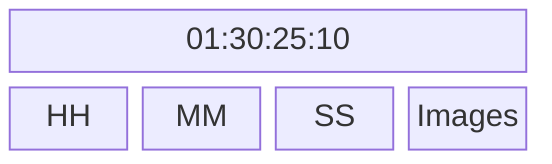

+++
draft = false
title = 'Initiation'
summary = "Démarrage d'un projet, raccourcis…"
weight = 1
slug = 'initiation'
editURL = 'https://github.com/sylvainconny/cours-eanis/edit/main/content/${FilePath}'
+++

## Démarrage

1. Dans le panneau projet, créer trois chutiers :
```tree
  - 01_EDIT | folder
  - 02_RUSHES | folder
  - 03_AUDIO | folder
  - 04_HABILLAGES | folder
```
2. Glisser les rushes dans le dossier **02_RUSHES**  (on peut le faire à l'import, dans l'option *Nouveau chutier*, on peut aussi en profiter pour créer une séquence *Bout à bout*)
3. Privilégier l'affichage en mode liste des chutiers plutôt qu'en mode Icône, ne serait-ce que pour économiser les ressources de l'affichage des images
4. Glisser les séquences (timelines) dans le dossier **01_EDIT**



Afin d'éviter que le panneau *Projet* ouvre un nouveau panneau à chaque fois qu'on souhaite ouvrir un chutier, aller dans **Edition > Préférences > Générales**, dans l'encadré Chutiers changer *Double-clic* en "Ouvrir dans la fenêtre".

En mode liste, on peut aussi modifier les métadonnées qu'on affiche pour se limiter à la définition, la durée, la fréquence par exemple et enregistrer ces préférences.

## Créer une séquence

1. Dans le panneau projet, sur le bouton *Nouvel élément"
2. Choisir Séquence dans le menu contextuel
3. Cliquer sur l'onglet Réglages de la fenêtre *Nouvelle séquence*
4. Choisir *Personnalisé* sur le menu déroulant *Mode de montage*
5. Régler les paramètres de la séquence en fonction du contexte du projet


À noter pour gérer les réglages plus rapidement, on peut glisser / déplacer un rush représentatif des paramètres souhaités sur le bouton *Nouvel élément*.

Il peut être pertinent de créer une séquence **01_DERUSH** pour faire une présélection des rushes qu'on souhaite garder. Puis une **02_OURS** pour un premier montage grossier avec les plans dans l'ordre, sans musique ni effet.

## Montage en 3 points
1. Sélectionner un rush en double-cliquant
2. Taper sur I (pour In) pour définir le début du rush à insérer dans la timeline
3. Taper sur O (pour Out) pour définir la fin du rush à insérer dans la timeline
4. Glisser / déplacer le rush prédécoupé dans la séquence ou taper sur la touche , pour l'ajouter en déplaçant / la touche ; pour ajouter et écraser

Dans la fenêtre source, sous la visionneuse il y a deux icônes *Pellicule* et *Waveform* qui permettent de ne sélectionner que la vidéo ou que l'audio de la sélection.


On peut n'ajouter que l'audio ou la vidéo en désélectionnant la source (A1 ou V1).


Tip : Ctrl + V colle un plan dans la timeline par écrasement, Ctrl + Maj + V colle un plan en décalant les plans

## Outils

### Sélection par défaut (V)
Dans ce mode on peut sélectionner les vidéos et surtout raccourcir les plans :
- par défaut, l'icône est rouge :
	- un raccourcissement laissera un blanc 
	- un rallongement détruira les plans connexes
- en maintenant Ctrl
	- à la fin ou au début d'un plan, l'icône devient jaune et l'outil devient Allongement
	- la souris placée entre deux plans, l'outil devient un déplacement de coupe

### Sélection en amont (A)
Permet de sélectionner toutes les pistes qu'il y a après la souris


- Maintenir Maj permet de ne sélectionner qu'une seule piste
- Maj + A retourner la direction de la sélection, sélectionne tout ce qu'il y a avant la souris (rappuyer sur A pour revenir à la sélection vers la droite)

### Allongement (B)
- Permet de réduire une vidéo sans laisser de vide, raccorde le reste de la timeline
- Peut également rallonger le plan sans destruction des vidéos connexes

### Déplacement de la coupe (N)
Entre deux plans, raccourci l'un et rallonge l'autre

### Modification de la vitesse (R)
Permet d'accélérer ou de ralentir un plan en sélectionnant / déplaçant les bords de la vidéo. Privilégier le raccourcis Ctrl + R qui permet de précisément définir la nouvelle vitesse.


Cette fenêtre permet de modifier précisément la vitesse et la durée du clip. Si les deux sont liés, une vitesse à 200% réduira de moitié le clip, une vitesse à 50% doublera la durée. On peut cependant délier la vitesse et la durée, le logiciel ira récupérer des images sur la suite de la source si possible et nécessaire. Une vitesse négative inversera le déroulement de la vidéo.

L'option *Propagation (décalage des éléments de fin)* permet de ne pas créer de trou dans la timeline ou d'écraser les éléments suivants.

### Cutter (C)
Coupe un plan ou plusieurs plans, peut être utilisé avec la tête de lecture dans n'importe quel mode avec Ctrl + K qu'on aura modifié en C dans Raccours clavier pour remplacer le passage à l'outil cutter. Précision importante, l'outil coupe soit le plan sélectionné, soit les plans des pistes sélectionnés.

### Déplacer la sélection (Y)
Permet de déplacer la position du *in* et du *out* de la vidéo sans changer la durée ou la position du plan dans la timeline.

### Déplacer le plan (U)
Fais glisser le plan dans la timeline sans modifier la position du *in* et du *out* de la vidéo en écrasant éventuellement les plans connexes. Ne modifie pas la timeline.

### Outil plume (P)
Utile au masking ou l'utilisation de keyframes, mais ce genre d'actions est plus confortable sur Adobe After Effects.

### Calques
Comme l'outil plume mais avec des formes prédéfinies : rectangle, ellipse, polygone.

### Main (H)
Déplacement manuel de la  timeline ou déplacement.
Permet également de déplacer la source ou le programme. En mode Sélection par défaut, on peut utiliser le bouton molette maintenu également.

### Zoom (Z)
Zoom dans la timeline. Alt pour dézoomer.
Meilleurs raccourcis dans d'autres modes :
- \+ pour dézoomer la timeline
- \- pour dézoomer la timeline
- Alt+ molette pour zoomer / dézoomer la timeline

### Texte (T)
Permet d'ajouter du texte dans le panneau programme.

### Magnétisme (S)
Magnétise / démagnétise les plans les uns aux autres.

### Marques (M)
Ajoute des marques sur la timeline ou sur les plans sélectionnés.
Pour éviter qu'elles changent de place en fonction des modifications de la séquence, aller dans le menu > *Marques* > décocher *Les marques suivent la séquence*.


## La timeline
- **Déplacement horizontal** :
	- la molette
	- les touches <- / -> du clavier pour un déplacement précis
	- Maj + <- / -> permettent un déplacement plus rapide
	- flèche du haut / flèche du bas pour un déplacement de cut en cut
	- touche Début et touche Fin pour aller au début ou à la fin de la timeline
- **Déplacement vertical** : Ctrl + molette
- **Changer la hauteur des pistes** : dans la zone de description des pistes,
	- Maj + molette change la taille de toutes les pistes audio ou vidéo
	- Alt + molette change la taille de la piste sur laquelle est positionnée la souris
	- Double-clic sur une piste change sa taille selon deux hauteurs prédéfinies
- **Options de pistes** :
	- *Activer visibilité de la piste* permet de masquer une piste vidéo dans la visionneuse Programme
	- *Mute* désactive le son d'une piste audio
	- *Solo* n'active que cette piste audio
	- *Cadenas* verrouille la piste, donc les éléments audio ou vidéo qui y sont ne bougeront plus


## Différence de tailles
Si on dans le menu contextuel d'un plan moins défini que la séquence, on peut ajuster ou définir le plan en fonction de la taille de l'image. Définir va modifier l'échelle dans les **options d'effet** ajuster va juste zoomer dans l'image.

## Libellés
Pratiques de changer la couleur des plans pour rapidement les différencier notamment dans le panneau *Projet*. On a utilisé le clavier numérique pour **binder** des libellés rapidement.



## Raccourcis utiles
- Ctrl + \- réduire les lignes de la timeline
- Ctrl + \+ agrandir les lignes de la timeline
- j, k et l pour circuler dans la timeline
- Double clic dans le panneau projet ou Ctrl + i pour "importer" (lier) de nouveaux éléments
- Ctrl + Maj + X pour annuler le *in* et *out* dans le panneau source
- Ctrl + glisser/déplacer un plan dans la timeline permet de l'intercaler facilement à un autre droit
- Maj\+Suppr supprime un élément dans la timeline et raccorde les éléments
- % met le panneau survolé par la souris prend tout l'espace dans la fenêtre Premiere Pro
- Ctrl\+% met la visionneuse Programme en plein écran
- Ctrl\+: créé un chutier
